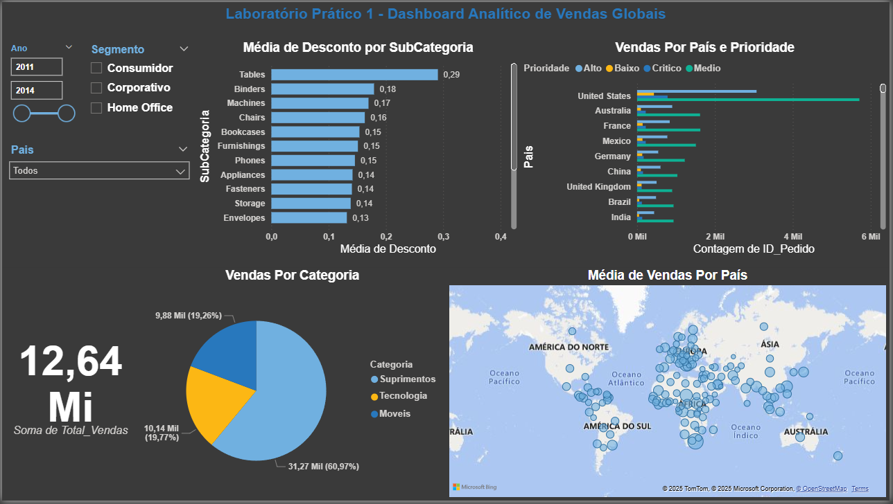

# Dashboard Analítico de Vendas Globais - Power BI

Este repositório contém um dashboard criado no **Power BI** para análise de vendas.

## 📊 Conteúdo
- Arquivo original em Power BI: [`LabPratico1.pbix`](LabPratico1.pbix)
- Versão em PDF: [`LabPratico1.pdf`](LabPratico1.pdf)
- Pré-visualização das página(s) (abaixo)

## 🔎 Prévia

  

---

## 💡 Observações
- Para abrir o arquivo `.pbix`, é necessário ter o **Power BI Desktop** instalado (gratuito): [Download](https://powerbi.microsoft.com/pt-br/desktop/).
- Caso queira interatividade, você pode baixar o arquivo e explorar no seu próprio Power BI.
